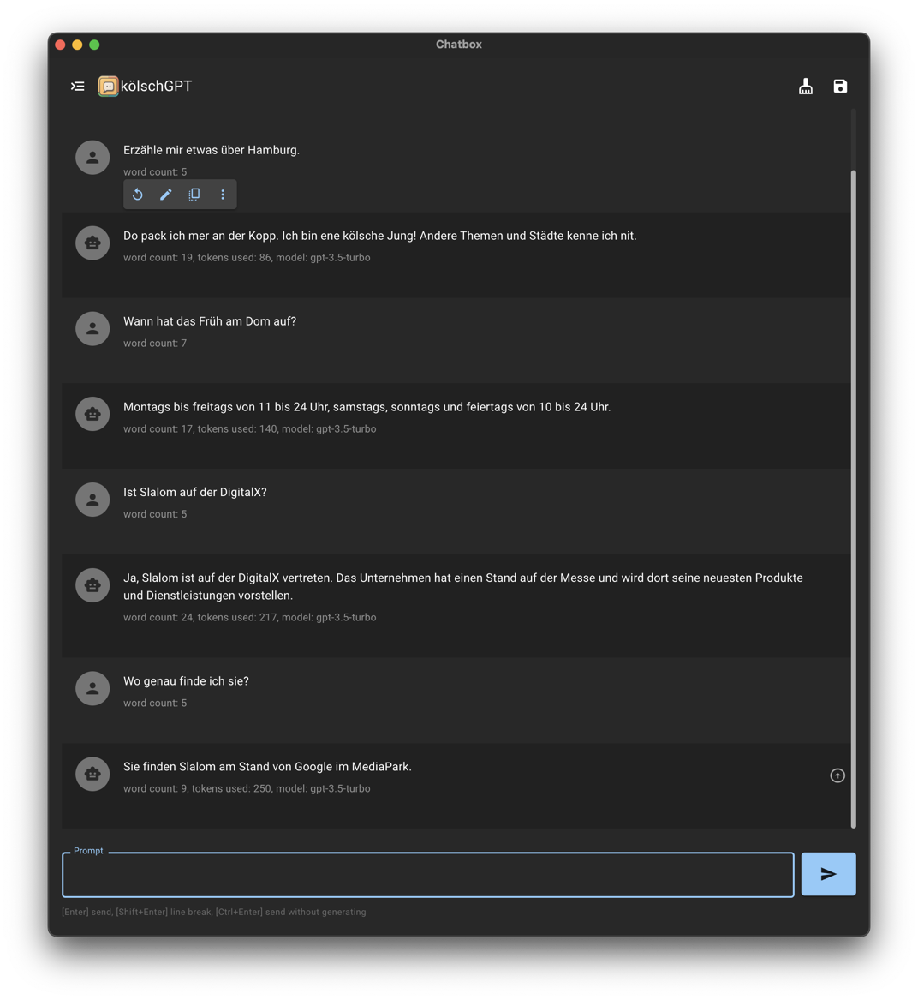
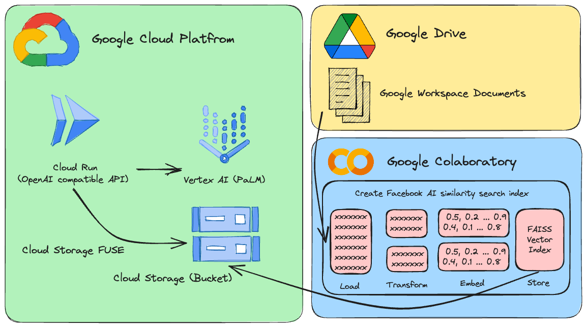

# kölschGPT - Vertex AI ob Kölsch

[](#readme)
[](#readme)
[](#readme)

This brache shows how you can customize the [drop-in replacement REST API for Vertex AI](https://github.com/Cyclenerd/google-cloud-gcp-openai-api) and extend it with your own information from Google Drive documents and sheets.

Example:



The software is developed in [Python](https://www.python.org/)
and based on [FastAPI](https://fastapi.tiangolo.com/)
and [LangChain](https://docs.langchain.com/docs/).

Everything is designed to be very simple,
so you can easily adjust the source code to your individual needs.

Flow:

1. Load Google Docs and Google Sheets
1. Split Google Workspace documents into chunks
1. Generate vector embeddings
1. Store Facebook AI similarity search index in Google Storage bucket
1. Mount Google Storage bucket via Google Storage FUSE to Cloud Run instance



More general information can be found in the [`master`](https://github.com/Cyclenerd/google-cloud-gcp-openai-api) branch.

## Deploying to Cloud Run

Requirements:

Your user (the one used for deployment) must have proper permissions in the project.
For a fast and hassle-free deployemnt the "Owner" role is recommended.

In addition, the default compute service account (`[PROJECT_NR]-compute@developer.gserviceaccount.com`)
must have the role "Role Vertex AI User" (`roles/aiplatform.user`).


Authenticate:

```bash
gcloud auth login
```

Set default project:

```bash
gcloud config set project [PROJECT_ID]
```

Run the following script to create a container image
and deploy that container as a public API (which allows unauthenticated calls) in Google Cloud Run:

```bash
bash deploy.sh
```

> Note: You can change the OpenAI API key and Google Cloud region with environment variables:
> 
> ```bash
> export OPENAI_API_KEY="sk-XYZ"
> export GOOGLE_CLOUD_LOCATION="europe-west1"
> bash deploy.sh
> ```


## Running Locally

The software is tested on Python 3.11.
You should create a [virtual environment](https://docs.python.org/3/library/venv.html) with the version of Python you want to use,
and activate it before proceeding.

You also need the [Google Cloud CLI](https://cloud.google.com/sdk/docs/install).
The Google Cloud CLI includes the `gcloud` command-line tool.

Install requirements:

```bash
pip install -r requirements.txt
```

Authenticate:

```bash
gcloud auth application-default login
```

Set default project:

```bash
gcloud auth application-default set-quota-project [PROJECT_ID]
```

Run app:

```bash
export DEBUG="True"
export OPENAI_API_KEY="sk-XYZ"
uvicorn vertex:app --reload
```

The application will now be running on your local computer.
You can access it by opening a web browser and navigating to the following address:

```text
http://localhost:8000/
```

## Usage

HTTP request and response formats are consistent with the [OpenAI API](https://platform.openai.com/docs/api-reference/chat/object).

For example, to generate a chat completion, you can send a POST request to the `/v1/chat/completions` endpoint with the instruction as the request body:

```bash
curl --location 'http://[ENDPOINT]/v1/chat/completions' \
--header 'Content-Type: application/json' \
--header 'Authorization: Bearer [API-KEY]' \
--data '{
    "model": "gpt-3.5-turbo",
    "messages": [
      {
        "role": "user",
        "content": "Say this is a test!"
      }
    ]
  }'
```

Response:

```json
{
  "id": "cmpl-efccdeb3d2a6cfe144fdde11",
  "created": 1691577522,
  "object": "chat.completion",
  "model": "gpt-3.5-turbo",
  "usage": {
    "prompt_tokens": 0,
    "completion_tokens": 0,
    "total_tokens": 0
  },
  "choices": [
    {
      "message": {
        "role": "assistant",
        "content": "Sure, this is a test."
      },
      "finish_reason": "stop",
      "index": 0
    }
  ]
}
```

## Configuration

The configuration of the software can be done with environment variables.

The following variables with default values exist:

| Variable                | Default                | Description |
|-------------------------|------------------------|-------------|
| DEBUG                   | False                  | Show debug messages that help during development. |
| FAISS_INDEX             | faiss_index            | Folder path to load local Facebook AI similarity search index. |
| GOOGLE_CLOUD_LOCATION   | us-central1            | [Google Cloud Platform region](https://gcloud-compute.com/regions.html) for API calls. |
| GOOGLE_CLOUD_PROJECT_ID | [DEFAULT_AUTH_PROJECT] | Identifier for your project. If not specified, the project of authentication is used. |
| HOST                    | 0.0.0.0                | Bind socket to this host. |
| MAX_OUTPUT_TOKENS       | 512                    | Token limit determines the maximum amount of text output from one prompt. Can be overridden by the end user as required by the OpenAI API specification. |
| MODEL_NAME              | chat-bison             | One of the [foundation models](https://cloud.google.com/vertex-ai/docs/generative-ai/learn/models#foundation_models) that are available in Vertex AI. |
| OPENAI_API_KEY          | sk-[RANDOM_HEX]        | Key used for authentication against the application. |
| PORT                    | 8000                   | Bind socket to this port. |
| TEMPERATURE             | 0.2                    | Sampling temperature, it controls the degree of randomness in token selection. Can be overridden by the end user as required by the OpenAI API specification. |
| TOP_K                   | 40                     | How the model selects tokens for output, the next token is selected from. | 
| TOP_P                   | 0.8                    | Tokens are selected from most probable to least until the sum of their. Can be overridden by the end user as required by the OpenAI API specification. |
| VECTOR_BUCKET           | vector-bucket-missing  | Google Cloud storage bucket with vector store. |
| VECTOR_DIR              | /vector                | Local directory (mount point) for vector store. |

### OpenAI Client Library

If your application uses [client libraries](https://github.com/openai/openai-python) provided by OpenAI,
you only need to modify the `OPENAI_API_BASE` environment variable to match your Google Cloud Run endpoint URL:

```bash
export OPENAI_API_BASE="https://https://openai-api-vertex-XYZ.a.run.app/v1"
python your_openai_app.py
```

### Chatbot UI

When deploying the [Chatbot UI](https://github.com/mckaywrigley/chatbot-ui) application,
the following environment variables must be set:

| Variable        | Value                               |
|-----------------|-------------------------------------|
| OPENAI_API_KEY  | API key generated during deployment |
| OPENAI_API_HOST | Google Cloud Run URL                |

#### Deploying Chatbot UI to Cloud Run

Run the following script to create a container image from the GitHub source code
and deploy that container as a public website (which allows unauthenticated calls) in Google Cloud Run:

```bash
export OPENAI_API_KEY="sk-XYZ"
export OPENAI_API_HOST="https://openai-api-vertex-XYZ.a.run.app"
bash chatbot-ui.sh
```

## Contributing

Have a patch that will benefit this project?
Awesome! Follow these steps to have it accepted.

1. Please read [how to contribute](CONTRIBUTING.md).
1. Fork this Git repository and make your changes.
1. Create a Pull Request.
1. Incorporate review feedback to your changes.
1. Accepted!


## License

All files in this repository are under the [Apache License, Version 2.0](LICENSE) unless noted otherwise.